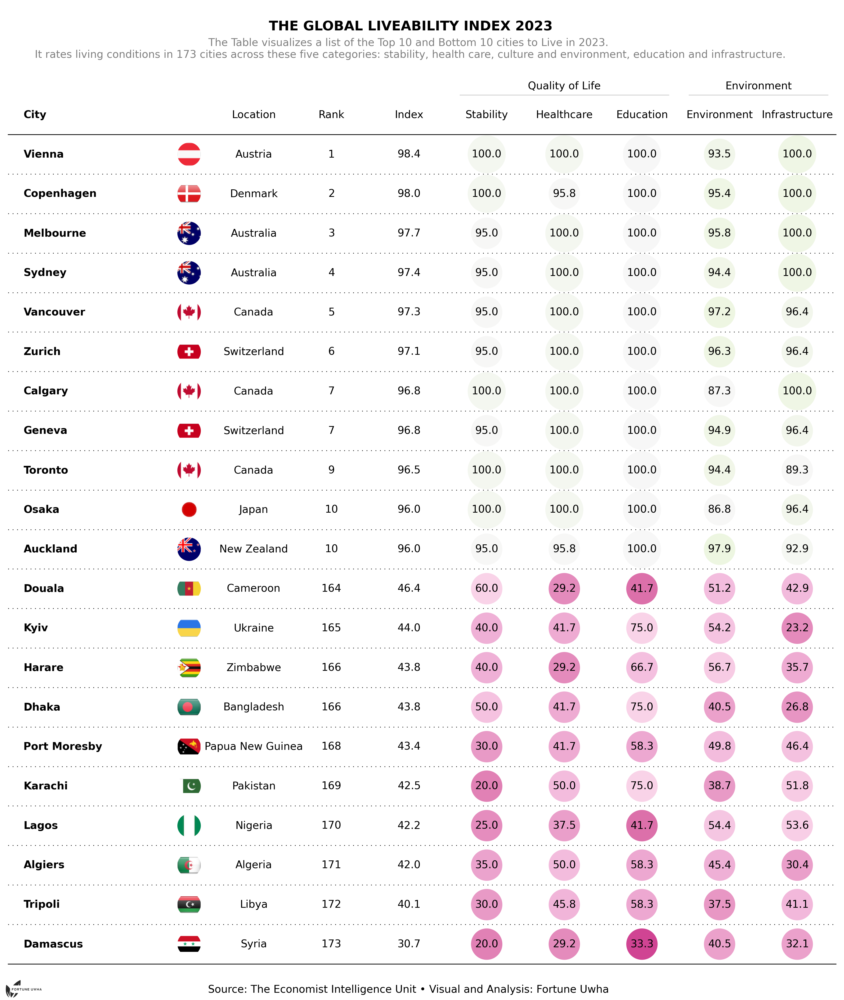

# Global-liveability-Index-2023
The findings of the latest liveability survey: optimism amid instability

# Airbnb Data Analytics/Visualisation Project: A Python-Panel Dashboard🗽
An interactive dashboard in Python from Jupyter Notebook using Open source visualisation tool Panel
## Table of Contents

- [Project Overview](#project-overview)
- [Getting Started](#getting-started)
- [Dependencies](#dependencies)
- [Data](#data)
- [Dashboard](#dashboard)
- [Usage](#usage)
- [Acknowledgement](#acknowledgement)
- [Contributing](#contributing)
- [License](#license)

## Project Overview📖

The goal of this project is to provide insights and visualizations based on the Airbnb data in New York City. It includes interactive charts and filters to explore different aspects of the data, such as pricing trends, neighborhood comparisons, and room types.

## Getting Started🦘
To get started with the project, follow these steps:

1. Clone the repository to your local machine.
2. Install the required dependencies (see the [Dependencies](#dependencies) section for details).
3. Get the EIU dataset for Global liveable cities (see the [Data](#data) section for details).
4. Run the project script or notebook to generate visualization and explore the data.

## Dependencies

The project relies on the following dependencies:

- Python 3
- Pandas
- Plottable

## Data

The dataset used in this project is obtained from the Economist Intelligence Unit released 2023 report on global liveability index. It rates living conditions in 173 cities across five categories: stability, health care, culture and environment, education and infrastructure. You can get the dataset [here](https://github.com/fortune-uwha/Global-liveability-Index-2023/blob/main/Data/cities.csv).

Once you have the dataset, update the file path in the project script or notebook accordingly.

## Table Dashboard Result⭐:

## Usage

To use the project, follow these steps:

1. Ensure you have the required dependencies installed (see the [Dependencies](#dependencies) section).
2. Make sure you have obtained the Airbnb dataset (see the [Data](#data) section).
3. Run the project script or notebook using Python.
4. View the visualization and adjust to analyze different aspects of the data.

## Acknowledgement
This project was inspired by the work and ideas of the plottable library. View documentation [here](https://plottable.readthedocs.io/en/latest/index.html)

## Contributing

Contributions to this project are welcome! If you find any issues or have suggestions for improvements, feel free to open an issue or submit a pull request.

## License

This project is licensed under the [MIT License](LICENSE).

